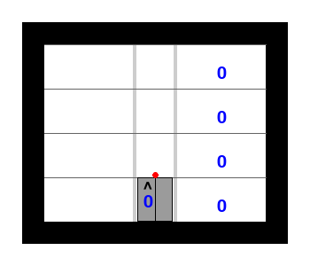
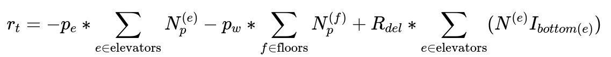

# Value Iteration Agent for Elevator Environment

## Installation

Use the package manager [pip](https://pip.pypa.io/en/stable/) to install the requirements for this assignment.

```bash
pip3 install wheel
pip3 install -r requirements.txt
```

## Usage

```python
cd agent
python3 agent.py
```

## The Elevator Environment


### Description
The Elevator domain models evening rush hours when people from different floors in a building want to go down to the bottom floor using elevators. Potential passengers arrive at a floor randomly. An elevator can move upwards to pick up passengers; once it opens its door to let people in, it can only move down towards the bottom floor, though the elevator can stop at intermediate floors to pick up more passengers.

Per each person in an elevator, there is a small penalty in rewards. Additionally, there is a penalty for each person waiting for an elevator.
When an elevator delivers a passenger to their destination, a large positive reward is given per person. So, a good policy should be able to minimize the penalties while maximizing the positive rewards by delivering many people so that they can go back home!

Even though original pyRDDL implementation is continious, we have converted the environment to be discrete.

### Map:
Here is Elevator example performing "some" policy.




### States
The state space represents number of people waiting and inside the elevators including elevator state as following:

State | Type | Desc | Math notation
--- | --- | --- | ---
num-person-waiting(floor) | int | Number of people waiting on a floor | $N^{(f)}_p$
num-person-in-elevator(elevator) | int | Number of people in an elevator | $N^{(e)}_p$
elevator-dir-up(elevator)  | bool | Direction of an elevator (True if going up) | $N^{(e)}_d$
elevator-closed(elevator) |	bool |	Whether the door is open or closed | $N^{(e)}_c$
elevator-at-floor(elevator,floor) | bool | 	Whether an elevator is on a specific floor | $N^{(e)}_l$

### Actions

There are 6 actions related to elevator control:

Actiom | Type | Desc
--- | --- | ---
move-current-dir(elevator) |	Discrete(2) |	Whether to move in the current direction (cannot move if door is open)
open-door(elevator) |	Discrete(2) |	Whether to open the door to let people in (direction changes to down afterwards)
close-door(elevator) |	Discrete(2) |	Whether to close door

``Discrete`` refers to [Gym Space type](https://www.gymlibrary.dev/api/spaces/#gym.spaces.Discrete).
### Reward

The reward for the environment defined as:



<!-- $$r_t = - p_e * \sum_{e \in \text{elevators}}{N^{(e)}_p} - p_w * \sum_{f \in \text{floors}} {N^{(f)}_p} + R_{del} * \sum_{e \in \text{elevators}} (N^{(e)} I_{bottom(e)})$$ -->


where
- $p_e$ is a penalty coefficient for people inside the elevator;
- $p_w$ is a penalty coefficient for people waiting in each floor;
- $R_{del}$ is a reward for delivering people to the bottom floor;

### Discretization

The Elevator environment has continious state space. We discretize all states to make that we can run algorithms that are taught in the class. The number of discrete state space is:

$$\text{Total Discrete States} = (N_{p_\text{max waiting}} + 1)^{N_f} * 2^{2N_e} * N_f^{N_e} * (N_{p_\text{max elevator}} + 1)^{N_e}$$

where $N_e$ is a number of elevators, $N_f$ is a number of floors, $N_{p_\text{max elevator}}$ is a number of maximum allowed people in the elevator, $N_{p_\text{max waiting}}$ is a number of maximum people to wait for the elevators at each floor.

### Problem Setup

For this assignment, you will deal with discretized environment. We have chose the following values for above variables:
- the number of elevators is, $N_e = 1$
- the number of floors are, $N_f = 4$
- the maximum allowed people inside the elevator is 10, $N_{p_\text{max waiting}}=10$
- the maximum waiting people for the elevator at any floor (except 1st floor) is 3, $N_{p_\text{max elevator}}=3$
- $p_e = 1.0$
- $p_w = 2.95$
- $R_{del} = 30.0$ 

### Objective
Your aim is to deliver as many as people from other floors to the 1st floor using a policy computed using Value Iteration.

## Instructions
    
- Fill in only the parts in the ``__init__.py`` file below the comments with "TODO".
- You may want to break down your ```value_iteration``` method into several methods (i.e., create additional supporting methods), but it is not required.
- Do not make any changes to any other methods or classes. 
- Do not forget to install requirements in the requirements.txt file before proceeding.
- You can view ``giff`` output for rendering under ``temp_vis`` folder

## More information
If you need more information to understand the task, we have prepared [colab notebook](https://colab.research.google.com/drive/15hepAPl4dfmCcqbH3RsWv_4CRvbO2qBb?usp=sharing) for you to getting started.

## References
1. Original pyRDDL github repository. [Link](https://github.com/ataitler/pyRDDLGym/tree/main)
2. IPPC 2023 Elevator Description. [Link](https://ataitler.github.io/IPPC2023/elevator.html)
3. OpenAi Gym Framework. [Link](https://www.gymlibrary.dev/index.html)
